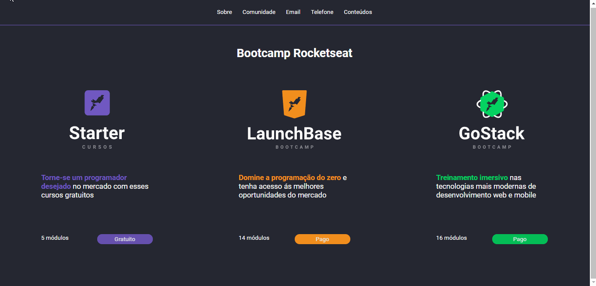

    

  
  

<blockquote align="center">“The key to transformation is continuity. Keep coding!”</blockquote>

 

<h1 align="center">Frontend Challenges</h1>

  <a href="#sobre-a-next-level-week">Application Presentation</a>&nbsp;&nbsp;&nbsp;&nbsp;|&nbsp;&nbsp;
  <a href="#sobre-a-next-level-week">Backend Challenges</a>&nbsp;&nbsp;&nbsp;&nbsp;|&nbsp;&nbsp;
  <a href="#sobre-a-next-level-week">Challenges</a>&nbsp;&nbsp;&nbsp;&nbsp;&nbsp;&nbsp;

 

## Application Presentation

  

## Frontend Challenges

    In these challenges we had to create a page that contain a grid where the 3 main Rocketseat courses should be shown: Starter, Launchbase and GoStack. When clicking on one of the courses, a modal must be opened where an iframe will load the information of the selected course. The modal have to contain an close buttom and a maximize buttom.

 

## Challenges

- [x] [Challeng One](desafio2-1)

- [x] [Challenge Two](desafio2-2)

- [x] [Challenge Three](desafio2-3)

 
 

<h3 align="center">
    
</h3>